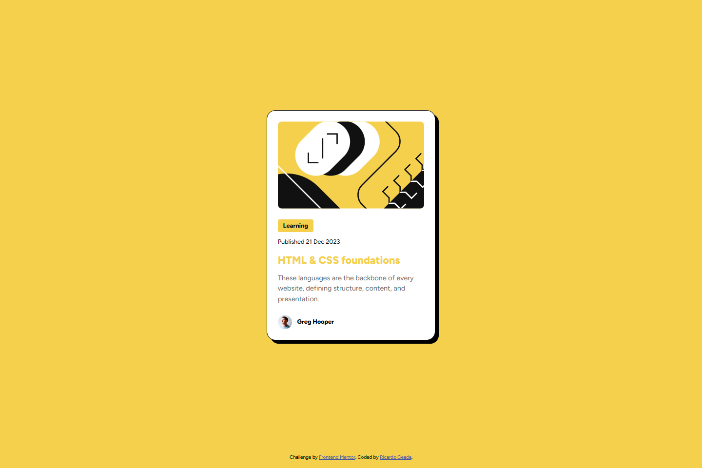

# Frontend Mentor - Blog preview card solution

This is a solution to the [Blog preview card challenge on Frontend Mentor](https://www.frontendmentor.io/challenges/blog-preview-card-ckPaj01IcS). Frontend Mentor challenges help you improve your coding skills by building realistic projects. 

## Table of contents

- [Overview](#overview)
  - [The challenge](#the-challenge)
  - [Screenshot](#screenshot)
  - [Links](#links)
- [My process](#my-process)
  - [Built with](#built-with)
  - [What I learned](#what-i-learned)
- [Author](#author)


## Overview

### The challenge

Users should be able to:

- See hover and focus states for all interactive elements on the page

### Screenshot



### Links

- Solution URL: [Link](https://github.com/RicardoGeada/fm-bloq-preview-card)
- Live Site URL: [Link](https://RicardoGeada.github.io/fm-bloq-preview-card/)

## My process

### Built with

- Semantic HTML5 markup
- CSS custom properties
- Flexbox

### What I learned

I learned a new technique to make fonts responsive using the clamp() function in CSS. It allows you to define a fluid font size that adapts between a minimum, a preferred value, and a maximum limit.

```css
.font {
    font-size: clamp(1rem, 2.5vw, 2rem);
}
```


## Author

- Website - [ricardogeada.com](https://www.ricardogeada.com)
- Frontend Mentor - [@RicardoGeada](https://www.frontendmentor.io/profile/RicardoGeada)


